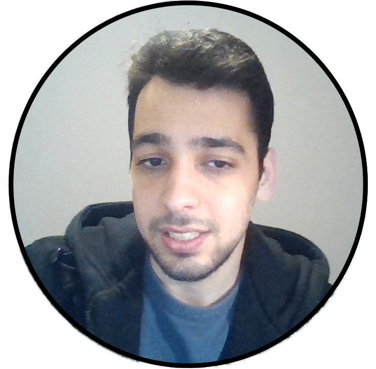
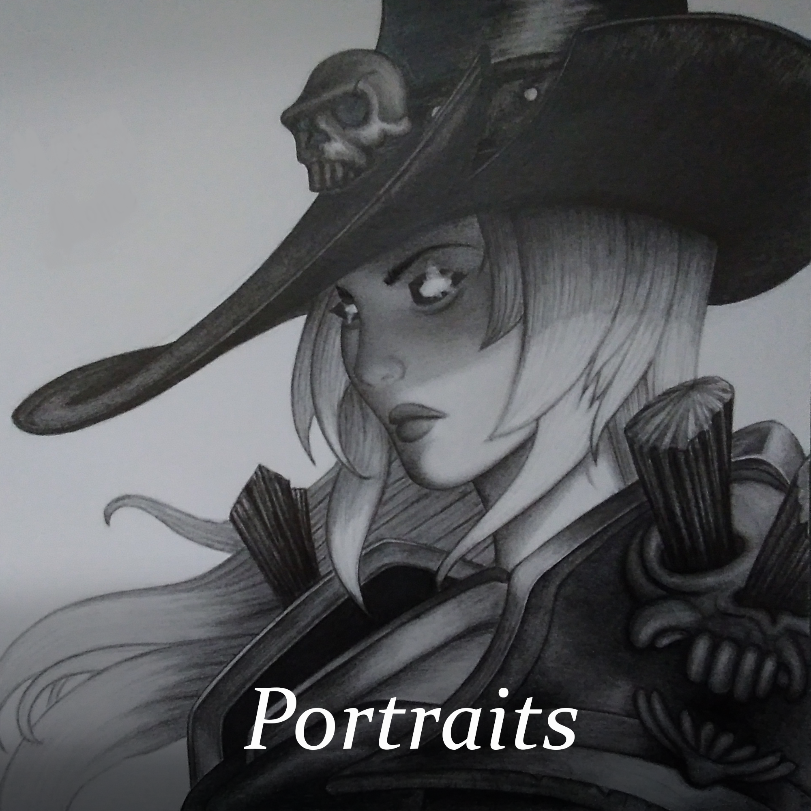
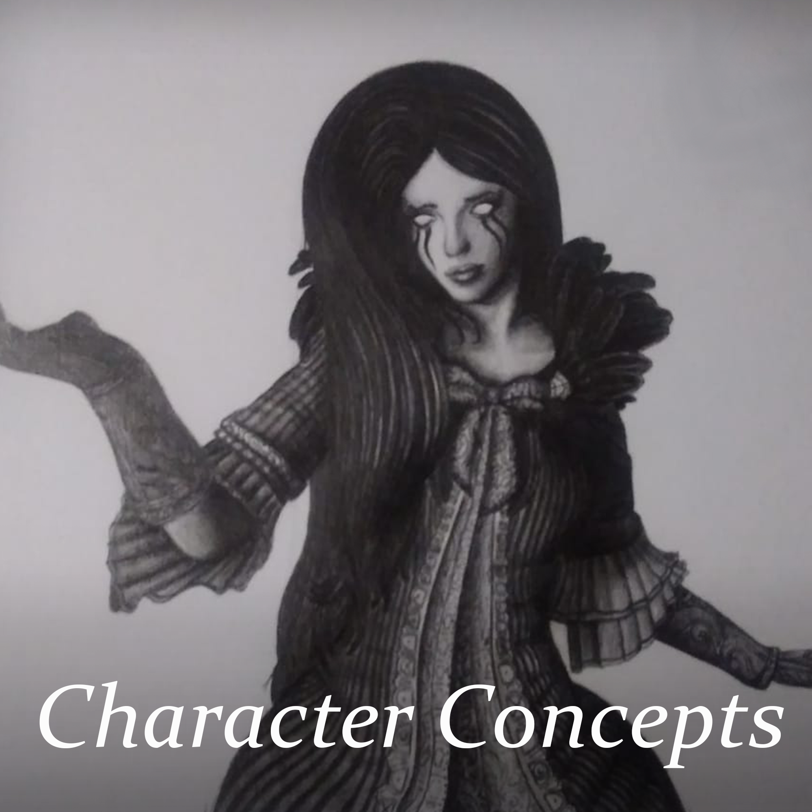
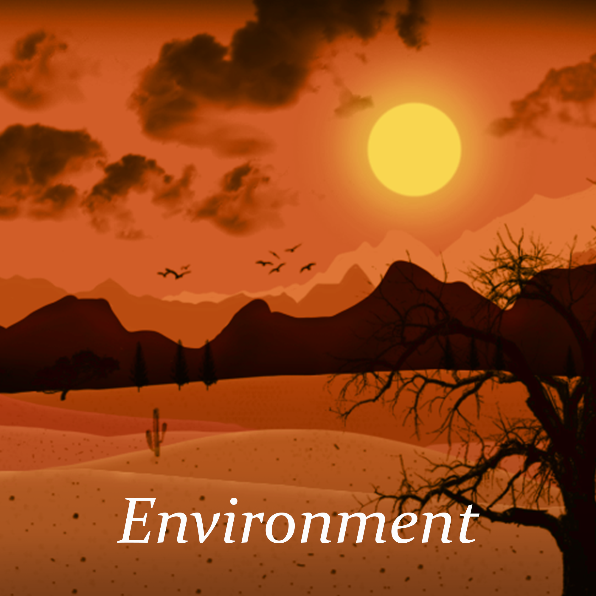
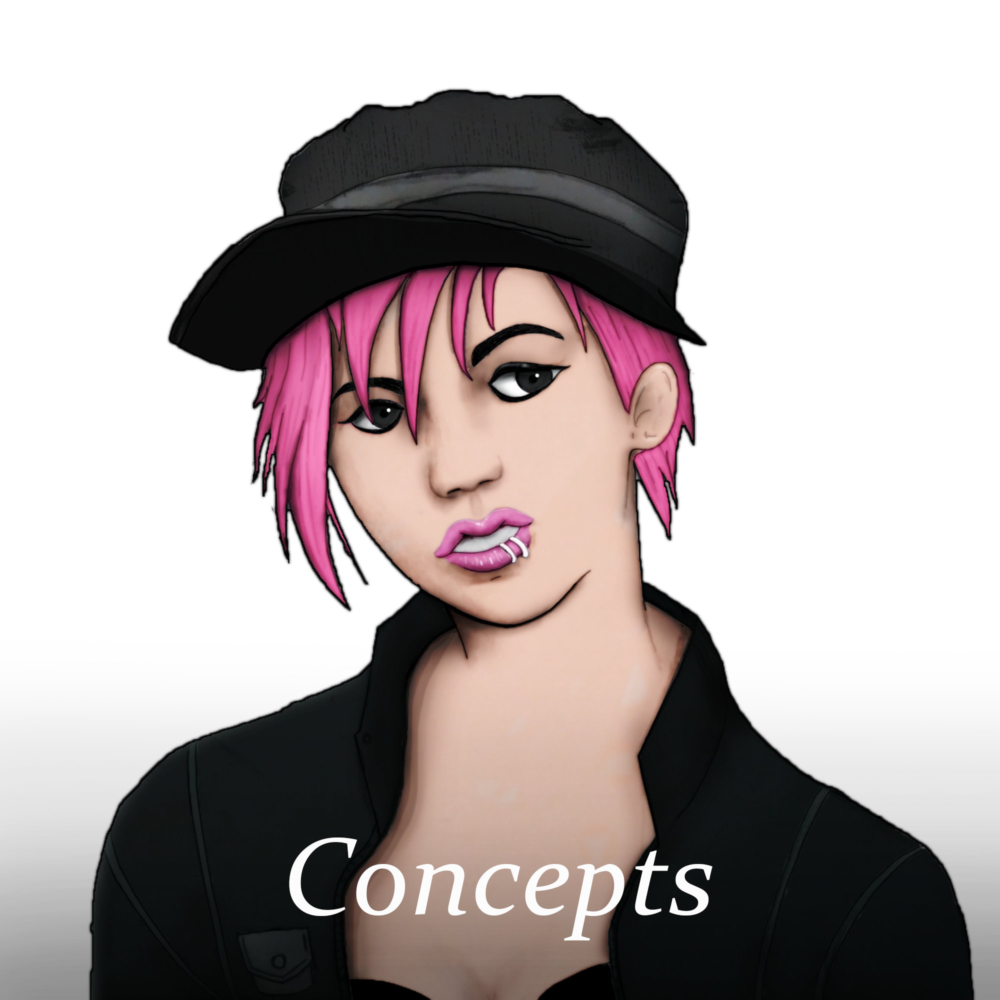
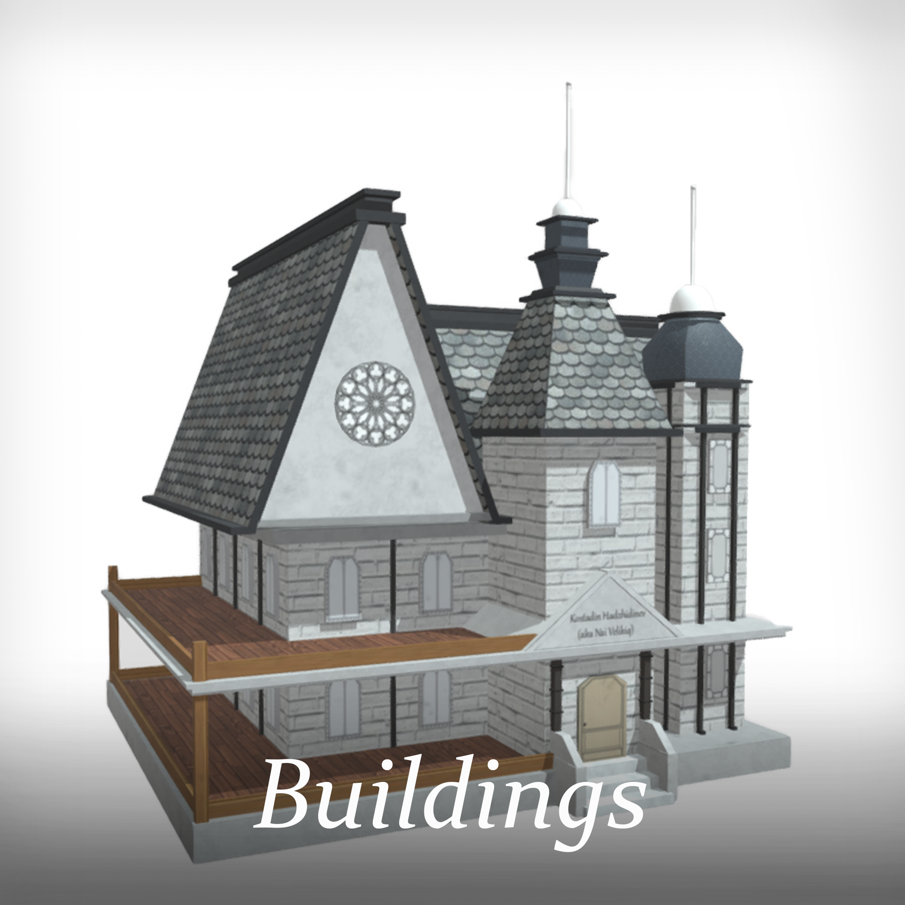
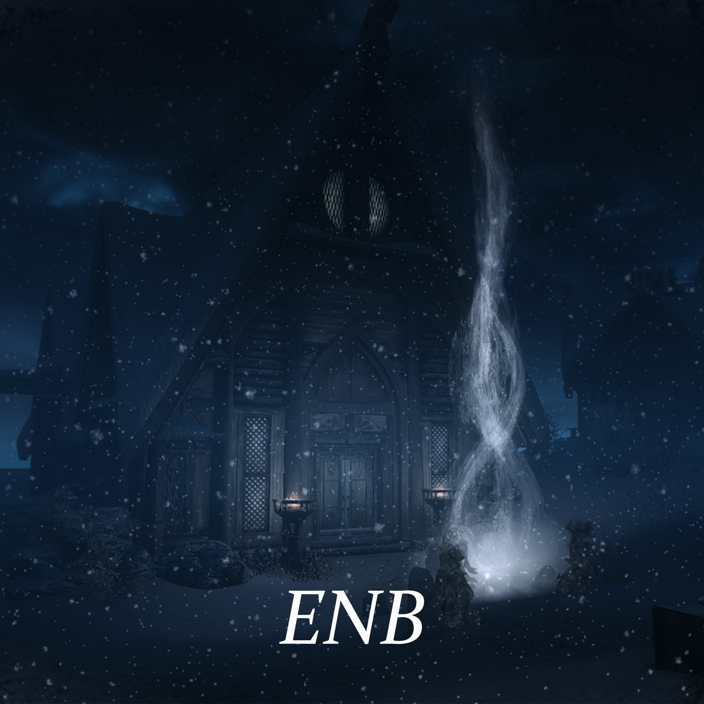

# Kostadin Hadzhidinev
I'm an aspiring artist that is currently getting into digital art. I also like to use different editors to create graphical modifications and assets for different games.

# Basic Info

**My Flickr** - [https://www.flickr.com/people/188978073@N06/](https://www.flickr.com/people/188978073@N06/)

**My Github** - [https://kostadinhdz.github.io/](https://kostadinhdz.github.io/)

**My Email** - kostadinh888@abv.bg

**Place of study** - Saxion University of Applied Sciences - Enschede, The Netherlands

# About Me

I'm but a humble junior artist that wants to study. Right now I'm focusing on learning how to draw digitally and exploring different software to create assets that can be used in games. When I have free time I like to draw(preferably with pencils for now) and I also enjoy creating mods for games using different editors. I like to draw character concepts, real life people and some other characters I've met throughout gaming and watching movies.

For the moment my goal is to expand my artist skillset by learning how to work with different popular programs.

# Education

**Bachelor Creative Media and Game Technologies(expected in the future)**

- My specialization in the CMGT workfield is being an Artist. I learn how to create digital assets using various programs.

# Skillset

**Software**
- Photoshop
- ENB postprocessor
- Unity Engine(beginner)
- Java(beginner)
- Maya
- 3ds Max
- Substance Painter

**Hand drawing**
- I can create very realistic drawings using pencils. Mainly character concepts or portraits but I can also draw environment.
- I can also draw with a graphical tablet using different programs(mainly photoshop).

**Languages**
- English(fluent)
- German(beginner)

## Pencil drawings

 

## Digital drawings

  

## Maya

## Other

